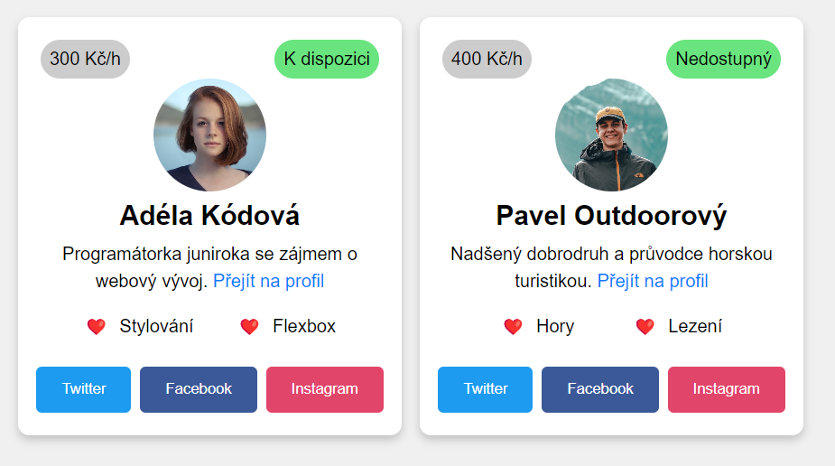

# selektory-BEM-cviceni

Máme html strukturu, výsledný obrázek a nějaké styly zadané od designéra. Naším úkolem je přejmenovat návrh tříd od designéra podle metodiky BEM, aby bylo výsledné CSS ploché, přehledné a dobře čitelné. Přejmenované třídy přiřadíme ke správným elementům v HTML. Na závěr doladíme stylování, aby odpovídalo návrhu. Využijeme flexbox, pseudotřídy a pseudoelementy.

 
